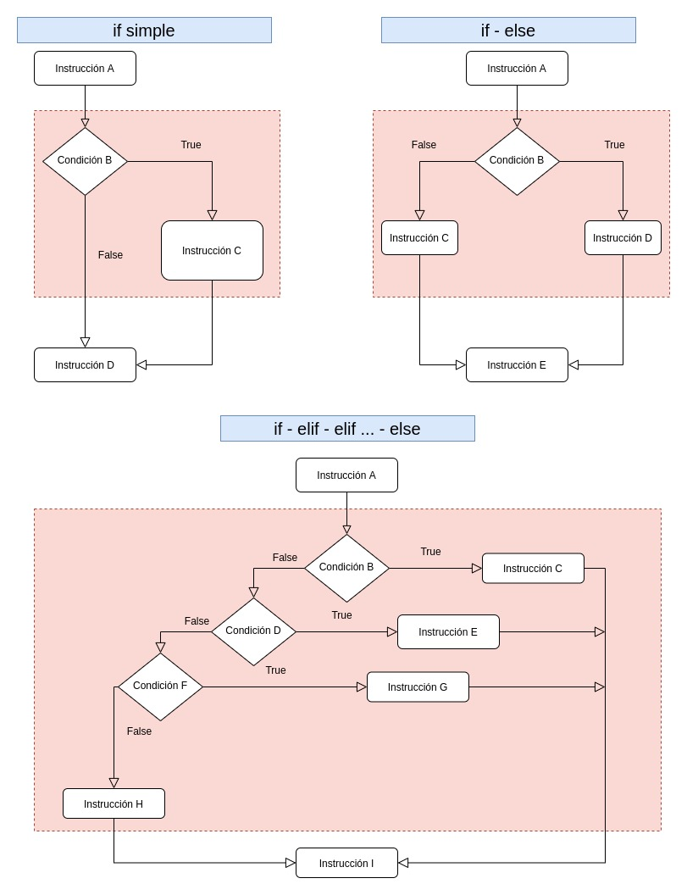

## Condicionales

### OBJETIVO

- Usar condicionales if, elif, else

#### REQUISITOS
 
1. Python 3

#### DESARROLLO

La sintaxis de la construcción if ... else ... es la siguiente:

```
if condición:
    aquí van las órdenes que se ejecutan si la condición es cierta
    y que pueden ocupar varias líneas
else:
    y aquí van las órdenes que se ejecutan si la condición es
    falsa y que también pueden ocupar varias líneas

```
La ejecución de esta construcción es la siguiente:

La condición se evalúa siempre.

Si el resultado es True se ejecuta solamente el bloque de sentencias pertenecientes al if.

Si el resultado es False se ejecuta solamente el bloque de sentencias 2.

El archivo condicionales.py incluye algunos ejemplos del uso de if, elif y else.

```
# If sirve para establecer una condición que de cumplirse ejecutará cierto código
edad  = 25
if edad > 18:
    print ("La persona es mayor de edad")

#El código dentro de else se ejecutará cuando no se cumpla la condición entablecida en el if

velocidad = 70
limite = 90

if velocidad > limite:
    print("Excedes el límite de velocidad")
else:
    print("Vas a una velocidad adecuada")
    
# En caso de tener varias opciones se puede usar Elif

numero = 7

if numero == 0:
    print("El número es 0")
elif numero > 0:
    print("El numero es positivo")
else:
    print("El numero es negativo")
```
Resumiendo, en la siguiente imagen muestra un diagrama de flujo de cada una de las estructuras if:




