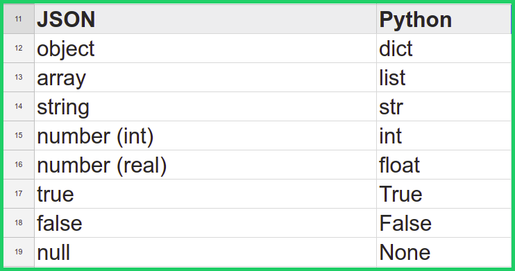

## Json

### OBJETIVO

- Convertir diccionarios a formato json y viceversa
- Escribir/Leer archivos .json

#### REQUISITOS

1. Python 3

#### DESARROLLO
JSON (JavaScript Object Notation), es un formato basado en texto, utilizado para transmitir y almacenar información estruturada. Es muy utilizado en diversas herramientas web. Guarda cierta similitud con los tipos de datos de Python.



### Archivos JSON

La 's' en los comandos de json (load**s** y dump**s**), indican que se trata de un string. También podemos manejar archivos mediante *load* y *dump*

```
n [5]: import json

In [6]: with open("ejemplo.json") as arch_txt:
   ...:     datos = json.load(arch_txt)
   ...: 

In [7]: datos
Out[7]: 
[{'id': 1, 'nombre': 'Hugo Mc Pato', 'edad': 5, 'genero': 'Pato'},
 {'id': 2, 'nombre': 'Paco Mc Pato', 'edad': 3, 'genero': 'Pato'},
 {'id': 3, 'nombre': 'Daisy Mc Pato', 'genero': 'Pata'}]

In [8]: datos.append(
   ...:     {
   ...:         "id": 4,
   ...:         "nombre": "Luis Mc Pato",
   ...:         "edad": 7,
   ...:         "genero": "Pato"
   ...:     }
   ...: )

In [9]: datos
Out[9]: 
[{'id': 1, 'nombre': 'Hugo Mc Pato', 'edad': 5, 'genero': 'Pato'},
 {'id': 2, 'nombre': 'Paco Mc Pato', 'edad': 3, 'genero': 'Pato'},
 {'id': 3, 'nombre': 'Daisy Mc Pato', 'genero': 'Pata'},
 {'id': 4, 'nombre': 'Luis Mc Pato', 'edad': 7, 'genero': 'Pato'}]

In [10]: with open("ejemplo-2.json", "w") as arch_txt:
    ...:     json.dump(datos, arch_txt)
    ...: 

In [11]: with open("ejemplo-2.json", "w") as arch_txt:
    ...:     json.dump(datos, arch_txt, indent=4)
    ...: 

In [12]: 
```

Crea un script `csvtojson.py` que dado un nombre de archivo en formato csv lo convierta a un archivo json de la forma:

```
[
    { /* Registro 1 */
        "campo1":valor campo 1,
        "campo2":valor campo 2,
        "campo3":valor campo 3,
        ...
        "campoN":valor campo N
    },
    { /* Registro 2 */
        "campo1":valor campo 1,
        "campo2":valor campo 2,
        "campo3":valor campo 3,
        ...
        "campoN":valor campo N
    },
    ...
]
```
Es requisito que el archivo de entrada incluya una primera fila con los nombres de las columnas y el nombre del archivo de salida deberá ser el mismo que el de entrada cambiando sólo la extensión a `.json`.

```
$ python csvtojson.py datos.csv
Se creó satisfactoriamente el archivo datos.json

$ ls
datos.csv    datos.json
```
